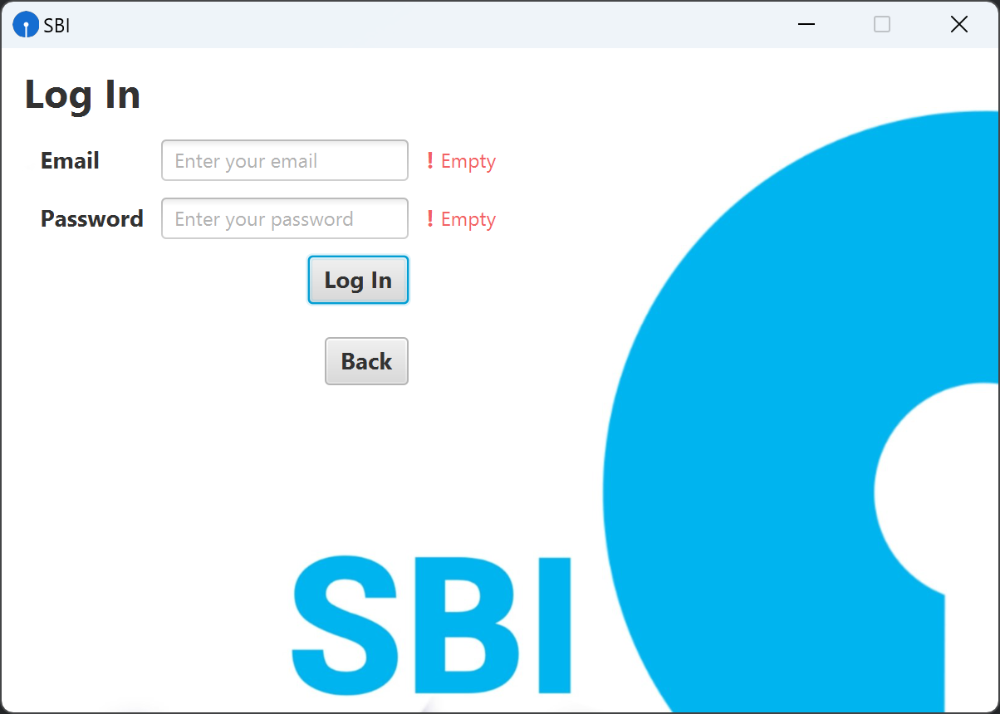

# 🏦 Banking Management System 🌐

[](https://www.oracle.com/java/technologies/javase/jdk14-archive-downloads.html) [](https://openjfx.io/) [](https://dev.mysql.com/downloads/connector/j/)

## Overview

This Banking Management System is a Java-based application with a MySQL database backend, designed for managing 🚀 banking operations. It allows users to perform various CRUD (Create, Read, Update, Delete) operations on the database, such as 💼 registration, 🚪 login, creating a bank account, 💰 crediting, 💳 debiting, checking balance, and transferring funds between existing accounts.

## Technologies Used ⚙️

-   **Java:** JDK 21 ☕
-   **JavaFX:** JavaFX SDK 17.0.9 🎨
-   **MySQL:** Connector/J 8.2.0 🛢️

## Dependencies 📑

1. **JavaFX SDK 17.0.9:** Used for building the graphical user interface (UI).

    - Download: [JavaFX SDK](https://openjfx.io/)

2. **MySQL Connector/J 8.2.0:** JDBC driver for MySQL, used for connecting to and interacting with the MySQL database.

    - Download: [MySQL Connector/J](https://dev.mysql.com/downloads/connector/j/)

## Instructions ℹ️

Clone this repository using the following command:

```bash
git clone https://github.com/Infi-null-0/Bank-Management-System.git
```

1. **Import Project:**

    - Import the project into IntelliJ IDEA.

2. **Add Libraries:**

    - Add the JavaFX SDK and MySQL Connector/J JAR files to your project's dependencies.
    - For JavaFX, add the JAR files or link to the JavaFX SDK library.
    - For MySQL Connector/J, add the JAR file to your project.

3. **VM Options for JavaFX:**

    - Set the VM options for JavaFX in your run configuration:

        ```
        --module-path "path/to/javafx-sdk-17.0.9/lib" --add-modules javafx.controls,javafx.fxml
        ```

        Replace "path/to/javafx-sdk-17.0.9/lib" with the actual path to your JavaFX SDK library.

4. **Main Class:**

    - Set the main class for your run configuration to be `BankSystem.BankingApp`.

5. **Database Configuration**🛢️:

    1. **Database Setup:**

        - In the `resources` folder, you'll find a `backup.sql` file.
        - Run the following SQL query in your MySQL database to set up the necessary tables:

            ```sql
            SOURCE /path/to/your/project/resources/backup.sql;
            ```

            Replace `/path/to/your/project` with the actual path to your project directory.

        - This one-click setup will create the required tables and populate initial data.

    2. **Update Connection Details:**

        - Open the Java code for the database connection (e.g., `BankingApp.java`).
        - Update the database connection details (username, password, etc.) if needed.

    Now, your MySQL database is set up with the required tables and initial data, making the setup process more convenient. 🚀

6. **Run Application:**

    - Run the `BankingApp` class to start the application.

## Functionality 🪛

-   **Registration:** Users can register with the system.
-   **Login:** Registered users can log in securely.
-   **Bank Account Creation:** Users can create a bank account after logging in.
-   **Credit/Debit Operations:** Perform credit and debit operations on the created bank accounts.
-   **Check Balance:** View the balance of a bank account.
-   **Transfer Funds:** Transfer funds between existing bank accounts.

## Input Validation❗

The application implements robust input validation, ensuring that user inputs are properly checked to prevent errors and enhance security.

## Screenshots





## Note for UI 🏧

-   This project is created for educational purposes and as part of a college project.The utilization of the SBI logo and background is done exclusively for aesthetic and user interface enhancement only. It is `not intended for any commercial or promotional purposes`.

This project is a non-commercial, educational endeavor, and any unintentional misrepresentation or `misuse of branding elements is not intended`.

## Thank You 😉
